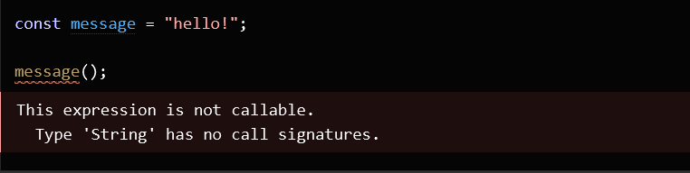
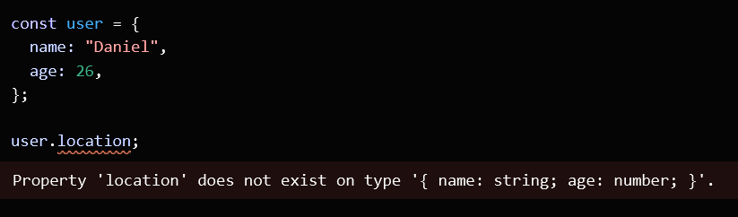

# Mer TypeScript

## Today

- Repetition TypeScript
- Kod-exempel med TypeScript
- Kod-exempel med Mongoose/MongoDb
- Examination assignment will be introduced tomorrow

---

## Why Use TypeScript?

- **Static Typing**: Catches errors at compile-time, preventing runtime bugs.
- **Improved Code Quality**: Enforces consistent data types across the codebase.
- **Enhanced Readability**: Type annotations and interfaces improve code clarity.
- **Refactoring Support**: Makes large codebases easier to refactor safely.
- **Interoperability with JavaScript**: Superset of JavaScript, making adoption seamless.
- **Tooling & Editor Support**: Autocompletion, inline documentation, and error highlighting.

**In short, TypeScript makes JavaScript development more robust and maintainable.**

---

## Static Type Checking

- **TypeScript** enforces type checking at compile-time.
- Prevents type-related runtime errors.
- Ensures data consistency by enforcing types.
- TypeScript detects errors early, reducing bugs in production.

**Example:**



---

## Non-Exception Failures

- TypeScript allows capturing failures without using exceptions.

  
**Example:**



---

## Type Annotations

- TypeScript can **explicit annotations** to define types.
- Improves readability and maintainability.
- Helps in conveying the expected type of variables and function arguments.

**Example:**

```typescript
let age: number = 30;
function greet(name: string): string {
  return `Hello, ${name}`;
}
```

---
 
## Type Annotations on Variables

**Example:**

```typescript
let myName: string = "Alice";
```

---

## Parameter Type Annotations

**Example:**

```typescript
// Parameter type annotation
function greet(name: string) {
  console.log("Hello, " + name.toUpperCase() + "!!");
}
```

---

## Return Type Annotations

**Example:**

```typescript
function getFavoriteNumber(): number {
  return 26;
}
```

---

## Interfaces

- **Interfaces** define the shape of an object.
- Used to enforce the structure of objects, including optional and readonly properties.
- `type` can also be used. Type aliases and interfaces are very similar, and in many cases you can choose between them freely

**Example:**

```typescript
interface Person {
  name: string;
  age?: number;
}

let mariko: Person = { name: 'Mariko' };
```

---

## TypeScript Compiler (TSC)

- `tsc` is the official TypeScript compiler.
- Transpiles TypeScript to JavaScript.
- Configurable via `tsconfig.json`.

```bash
tsc file.ts
```

---

## TSC: Strictness Options

- **Strict mode** enables a collection of type-checking options.
- Ensures better type safety by catching more errors.
- Set in `tsconfig.json`

```json
{
  "compilerOptions": {
    "strict": true,
  }
}
```

---

## noImplicitAny

- Disallows implicit `any` types.
- Can be turned off to use off to code in both JavaScript and TypeScript at the same time.

```json
{
  "compilerOptions": {
    "noImplicitAny": true
  }
}
```

**Example:**

```typescript
function log(message) {
  console.log(message); // Error: Parameter 'message' implicitly has an 'any' type
}
```

---

## Links

- [TypeScript Handbook](https://www.typescriptlang.org/docs/handbook/intro.html)
- [TypeScript Cheat Sheets](https://www.typescriptlang.org/cheatsheets/)
- [Experiment with Typescript in the browser](https://www.typescriptlang.org/play)
- [Exercises](https://typescript-exercises.github.io)
- [More difficult exercises](https://github.com/type-challenges/type-challenges)

---

## Demo JavaScript vs TypeScript

- Create two files: `index.js` and `index.ts`
- Create `const message = "hello";` and try calling it as a function
- Create an object with a couple properties and try accessing a non-existant property
- Create a function that uses ´Math.random()´ and call it without function parentheses
- Compile using ´tsc´ and check the output.

---

## Demo Mongoose/MongoDB med TypeScript

### Pseudokod

1. `@types/express @types/mongoose nodemon tsx typescript dependencies express mongoose`
2. Create the files `index.ts` that starts the app, `connect.ts` that connects to database and call it in `index.ts`
3. Create folders controllers, models, routes
4. Add `bookController.ts`, `bookModels.ts` and `bookRoutes.ts`
6. Create an interface Book with some properties and use it to define the schema in `bookModels.ts`
5. Add schema, database access and routes.

